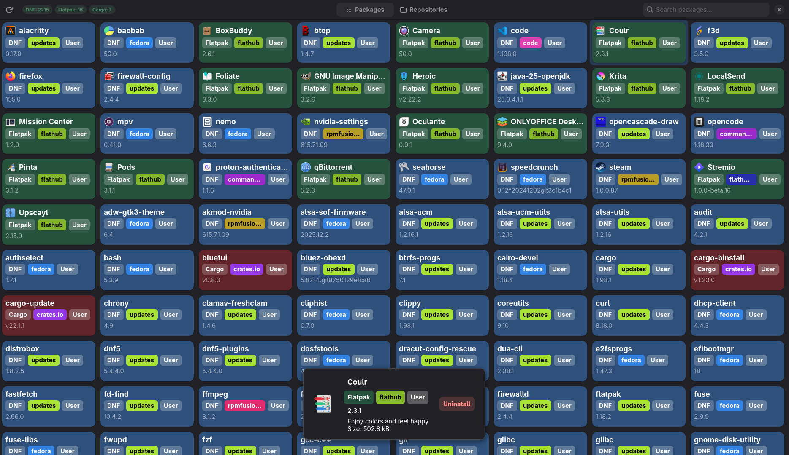
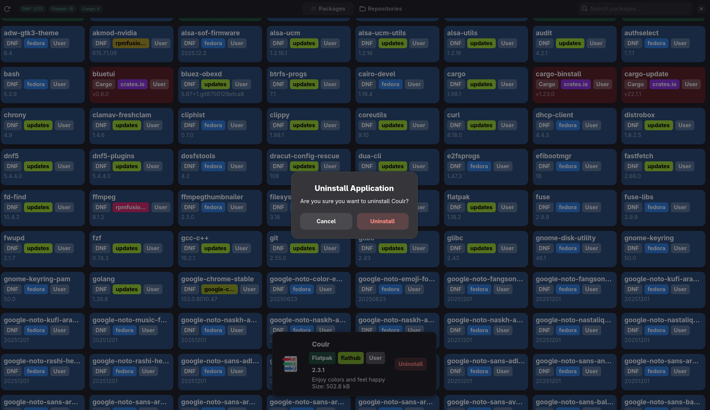
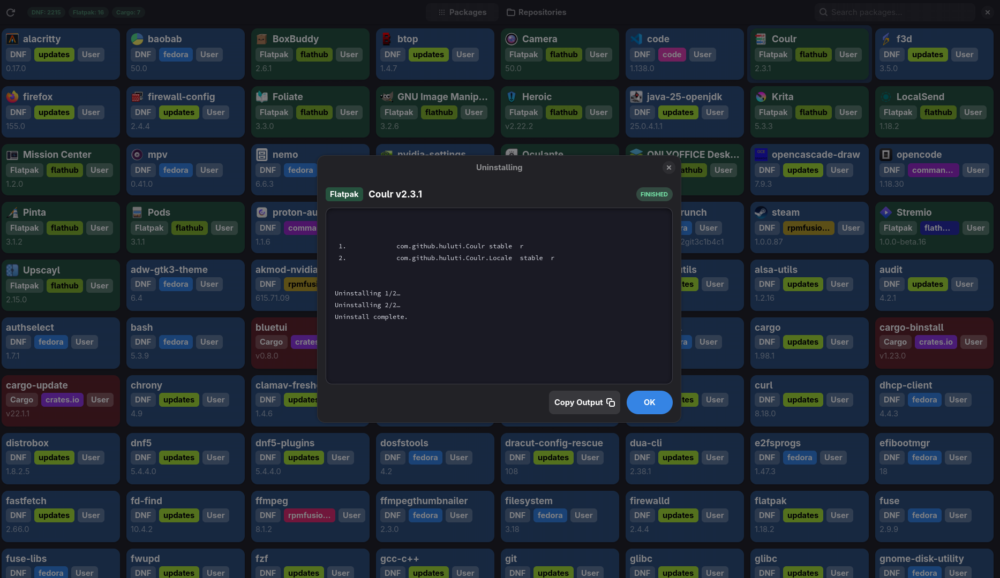

# Bubblegum

A unified package manager GUI, manage all your packages across **DNF**, **Flatpak**, and **Cargo** from one place.

## Screenshots






## Features

- **Unified package list** — view and search all installed packages from DNF, Flatpak, and Cargo in one grid
- **Fuzzy search** — instant filtering as you type
- **Repository information** — view repositories/remotes for each package manager
- **Package details** — select a package to see full info in a bottom panel
- **Uninstall flow** — safe confirmation dialog with PolicyKit support
- **Responsive UI** — built with GTK4 + Libadwaita, adapts to any window size

## Building

### Dependencies

- Rust 
- GTK4, Libadwaita 
- At least one of: DNF, Flatpak, Cargo

### Build, Run & Install

```bash
# Build release binary
make build

# Run
make run

# Install to ~/.local (binary to ~/.local/bin, desktop entry to ~/.local/share/applications)
make install

# Uninstall
make uninstall
```

## License

GPL-3.0-or-later — see [LICENSE](LICENSE).
